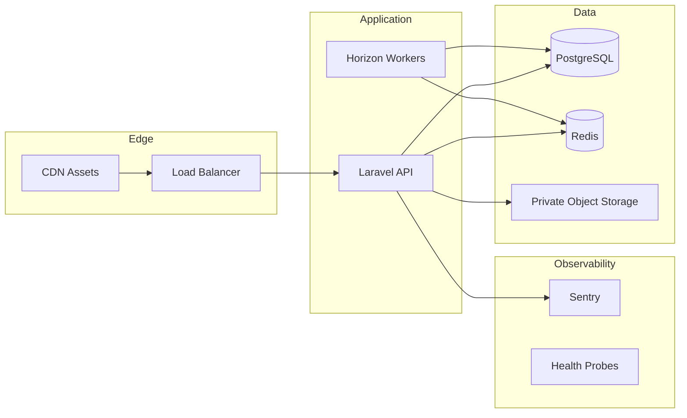

# Production Stabilization & Hardening (Final Pass)

## 1. Final SaaS readiness assessment

**Verdict: Ready for controlled production rollout** after completing the deployment checklist below.

| Area | Score | Notes |
|------|-------|-------|
| Multi-tenancy | Strong | TenantScope + clinic_id on core models |
| Security | Good | 2FA, CSP, secure uploads, hardened seeders, MustVerifyEmail |
| Performance | Good | Redis path, Horizon, tenant cache, queued Excel exports |
| Observability | Good | Sentry integrated, `/health`, Horizon |
| Scheduling | Good | Slots/conflicts; doctor schedule CRUD UI added |
| Billing | Good | Cashier + platform payments |
| Communications | Partial | Reminder channel abstraction; email/SMS providers TBD |
| Platform UX | Partial | Widget unification deferred; metrics cached |

## 2. Remaining technical debt

| Item | Priority | Notes |
|------|----------|-------|
| PDF exports still synchronous | Medium | Queue + notification pattern (same as Excel) |
| Platform dashboard widget system | Low | Visual consistency pass |
| Public booking / booking links | Medium | Architecture prepared via scheduling services |
| Recurring appointments / rooms | Low | Schema hooks in scheduling tables |
| Legacy attachment migration job | Medium | Run `attachments:audit-public`, batch migrate |
| Symfony CVE advisories | High | Run `composer update` on Linux CI (see § Composer) |
| Chart PNG export | Low | Optional enhancement |
| Email/SMS/WhatsApp providers | Medium | Implement `ReminderChannelSender` adapters |

## 3. Security posture summary

- **Secrets:** Documented rotation in `docs/SECURITY_CREDENTIAL_ROTATION.md`; env-only config enforced
- **Seeders:** `SecureSeeder` blocks weak passwords unless `SEED_ALLOW_INSECURE=true` (non-production)
- **2FA:** Platform owner enforcement in production; disabled in PHPUnit/CI
- **Email verification:** `User` implements `MustVerifyEmail`; routes use `verified` middleware
- **Login:** Legacy plaintext upgrade disabled in production
- **Attachments:** New uploads private; audit command for legacy `public` rows
- **Authorization:** Policies for visits, patients, invoices, attachments, staff, expenses, doctor schedules

## 4. Performance readiness summary

- Redis-backed cache/queue/session (production `.env`)
- Queued Excel exports when `QUEUE_CONNECTION≠sync`
- Dashboard/report tenant caching with invalidation
- SPA fragment LRU cache; Vite manual chunks

## 5. Scalability assessment

- Horizontal: stateless PHP + Redis + PostgreSQL + Horizon workers
- Tenant cache prefix invalidation via Redis when available
- Export files per-user under `storage/app/exports/{userId}/`

## 6. DevOps readiness assessment

- CI: 2FA bypass env vars, aligned `DB_PASSWORD=postgres`
- Docker: app, horizon, scheduler, redis, postgres
- Sentry: `SENTRY_LARAVEL_DSN` in production only
- Health check token for orchestrators

## 7. Recommended next-generation roadmap

1. **Phase 6 — Communications:** Twilio/WhatsApp, SMTP, queued PDF exports
2. **Phase 7 — Growth:** Public booking portal, Stripe billing self-serve, analytics warehouse
3. **Phase 8 — Scale:** Read replicas, CDN, k6 load tests in CI

## 8. Suggested architecture evolution



---

## Deployment checklist

```bash
# Production .env (minimum)
APP_ENV=production
APP_DEBUG=false
SEED_ALLOW_INSECURE=false
CACHE_STORE=redis
QUEUE_CONNECTION=redis
SESSION_DRIVER=redis
SENTRY_LARAVEL_DSN=https://...
PLATFORM_OWNER_PASSWORD=<strong-unique>
SEED_ADMIN_PASSWORD=<strong-unique>

composer install --no-dev --optimize-autoloader
php artisan migrate --force
php artisan config:cache
php artisan route:cache
npm run build
php artisan horizon  # supervised
```

## Composer security advisories

Symfony components (`http-kernel`, `mailer`, `mime`, `routing`) have CVE advisories. On Linux CI/production:

```bash
composer update symfony/http-kernel symfony/mailer symfony/mime symfony/routing --with-all-dependencies
composer audit
```

Document any remaining advisories in release notes if upstream pins prevent immediate resolution.
